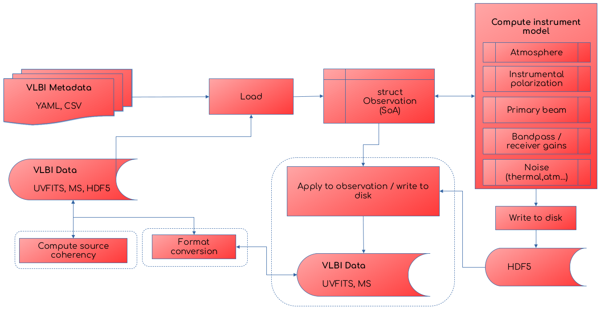

# Components

`Anime` can be run in two modes: imported as a module with callable functions or as a single pipeline that accepts input settings in `YAML` and `CSV` files and runs without human intervention. The following diagram gives an overview of the design.



`Anime` loads the metadata of the VLBI observation and the observed data into a Structure-of-Arrays (SoA) in-memory representation with which all the functions that compute instrument models are expected to interface. The generated models (also referred to as *gain tables*) are written out to an HDF5 file. The functionality within the dotted boxes are not considered essential to the generation of instrument models, but are provided for completion. These include
1. generation of an MS from scratch,
2. computing and writing source coherency to MS, and
3. applying instrument models to data and writing them back to the MS.
In modular mode, any calibration or imaging software can call any function in the box "Compute instrument model" and process the gain tables as they see fit. In pipeline mode, the entire control flow is automated by using a YAML file as shown below.

## Input files

### Observation parameters
Functions such as [`msfromconfig`](@ref Anime.msfromconfig) require the user to input various arguments that define the parameters of observation. For ease of use, these parameters can be collected in a YAML file which can be passed directly to `Anime` in pipeline mode.

```yaml
####################################################
# sample config file for AnimeDriver.jl
####################################################
# settings to generate a new ms

mode: "manual"                                       # "uvfits" and "manual" are the only allowed values
msname: "eht.ms"                                  # name of output ms 
telescopename: "VLBA"                                # preset telescope known to casa (not important since CASA is not used for predict; just an argument required for setconfig)
stations: "inputs/eht_2017.stations"     # CSV file with station parameters
casaanttemplate: "inputs/antenna_table.template"                 # Input CASA ANTENNA table to use as template
vex: "inputs/vexfiles/e17e11.vex"    # name of the VEX schedule to use for observing
uvfits: "inputs/vfitsfiles/hops_lo_3601_M87+zbl-dtcal_selfcal.uvfits" # name of uvfits file to convert to ms
autocorr: false                                      # toggle whether to include autocorrelations
feed: "perfect R L"                                  # "perfect R L" or "perfect X Y"
shadowlimit: 1e-6                                    # maximum fraction of geometrically shadowed area before flagging occurs
elevationlimit: "10deg"                              # minimum elevation angle before flagging occurs
source:
  M87:
    RA: "12h30m49.42"                                # right ascension of source position in hours
    Dec: "+12.23.28.04"                              # declination of source position in degrees
    epoch: "J2000"                                   # "J2000" or "B1950"
scans: 5                                             # number of scans
scanlengths: [600.0, 600.0, 600.0, 600.0, 600.0]                              # list of lengths of each scan in seconds
scanlag: 180.0                                     # lag time between scans in seconds
exposure: 0.4                                          # integration time in seconds
stokes: "RR RL LR LL"                                # CASA understandable Stokes types to simulate (check official MS specification)
spw:
    centrefreq: [229.0e9]                            # centre frequency of spw in Hz
    bandwidth: [2e9]                               # bandwidth of spw in Hz
    channels: [16]                                   # number of channels in spw
starttime: "UTC,2021/04/28/00:00:00.00"              # starting time of the first scan in the observation

####################################################
# settings for wsclean predict

osfactor: 8191                                       # oversampling factor for WSClean
skymodel: "inputs/sourcemodels/point"       # HDF5 file or directory containing FITS files
polarized: false                                     # toggle source model polarization
channelgroups: 1                                     # number of groups to divide the channels into for computing source coherencies

####################################################
# common settings

correff: 0.88                                      # correlator efficiency for 2 quantization bits (use 0.636 for 1-bit)
corruptseed: 456                                     # seed to be used for generating random variables for corruptions (except for troposphere)
diagnostics: true                                  # generate diagnostic plots and logs

####################################################
# settings for atmospheric corruptions

troposphere:                                         # add troposphere
  enable: false
  wetonly: false                                     # add only the wet component
  attenuate: true                                   # signal attenuation due to opacity
  skynoise: true                                    # add tropospheric contribution to sky noise
  meandelays: true                                   # add mean delays
  fixdelays: false                                   # add fixed delays 
  turbulence: true                                  # add turbulent phases
  tropseed: 873256                                      # independent seed for generating random variables for troposphere

ionosphere:                                          # add ionosphere
  enable: false

####################################################
# beam and pointing settings

pointing:
  enable: true
  mode: "gp"                                         # "gp" (Gaussian processes) or "normal" (Gaussian)
  interval: 5.0                          # time interval (in seconds) after which to generate new pointing errors (<=0.0 for "mean(coherencetime)")
  scale: 100.0                                   # scale mixture parameter for long-term smoothness

####################################################
# settings for instrumental polarization

instrumentalpolarization: 
  enable: false                                       # add instrumental polarization
  mode: "gp"                                     # "gp" (Gaussian processes) or "normal" (Gaussian)
  visibilityframe: "sky"                             # visibilities are written out in "sky" frame

####################################################
# settings for gains

stationgains: 
  enable: false                                      # add antenna gains
  mode: "gp"                                     # "gp" or "normal"
bandpass: 
  enable: false                                      # add bandpass effects 
  bandpassfile: "inputs/eht_2017.bandpass" # csv file containing bandpass information for all stations

####################################################
# noise settings

thermalnoise: 
  enable: false                                      # toggle thermal noise
```
Section 1 contains parameters for creating a new MS from scratch. If `mode = "uvfits"` then most of these are irrelevant (see [here](examples/createdataset.md#in-uvfits-mode)). The following sections contain parameters specific to the computation of various instrument models to be passed as arguments to corresponding functions.

### Site and station parameters
`CSV` files containing station and weather parameters are used for a more detailed specification of the necessary input information. The station information file contains, for each station, the position of the antennas, weather parameters for computing atmospheric models, complex receiver gains and polarization leakage, and mount and feed information. An example station information file looks like this:
```csv
station,x_m,y_m,z_m,dishdiameter_m,sefd_Jy,pwv_mm,gpress_mb,gtemp_K,ctime_sec,pointingrms_arcsec,pbfwhm230_arcsec,pbmodel,aperture_eff,g_pol1_loc,g_pol1_scale,g_pol2_loc,g_pol2_scale,d_pol1_loc,d_pol1_scale,d_pol2_loc,d_pol2_scale,feedangle_deg,mount,feed
AA,2225060.8136,-5440059.59994,-2481681.15054,73,60.0,1.5,555,271,10,1.0,27,gaussian,0.73,1.0+0.0im,0.1+0.1im,1.06+0.0im,0.1+0.1im,-0.05+0.03im,0.001+0.001im,0.03-0.04im,0.001+0.001im,0.0,ALT-AZ,linear
AP,2225039.52970,-5441197.62920,-2479303.35970,12,3300.0,1.5,555,271,10,1.0,27,gaussian,0.63,0.95+0.06im,0.1+0.1im,1.0+0.07im,0.1+0.1im,0.03-0.03im,0.001+0.001im,0.05+0.03im,0.001+0.001im,0.0,ALT-AZ+NASMYTH-R,circular
AZ,-1828796.20000,-5054406.80000,3427865.20000,10,7700.0,4.4,695,276,3,1.0,32,gaussian,0.57,1.1+0.0im,0.1+0.1im,0.9+0.0im,0.1+0.1im,0.03+0.04im,0.001+0.001im,0.035-0.03im,0.001+0.001im,0.0,ALT-AZ+NASMYTH-R,circular
LM,-768715.63200,-5988507.07200,2063354.85200,32,2400.0,5.7,604,273,6,1.0,10,gaussian,0.31,1.1+0.05im,0.1+0.1im,1.2+0.1im,0.1+0.1im,0.03-0.03im,0.001+0.001im,0.03+0.0im,0.001+0.001im,0.0,ALT-AZ+NASMYTH-L,circular
PV,5088967.74544,-301681.18586,3825012.20561,30,1000.0,2.9,723,273,4,0.5,11,gaussian,0.43,1.04+0.0im,0.1+0.1im,1.05+0.0im,0.1+0.1im,0.03+0.06im,0.001+0.001im,-0.04+0.03im,0.001+0.001im,0.0,ALT-AZ+NASMYTH-L,circular
SM,-5464555.49300,-2492927.98900,2150797.17600,15,3300.0,1.5,626,278,5,1.5,55,gaussian,0.73,0.97+0.1im,0.1+0.1im,1.1+0.05im,0.1+0.1im,-0.03+0.03im,0.001+0.001im,0.045+0.0im,0.001+0.001im,45.0,ALT-AZ+NASMYTH-L,circular
```

The bandpass information file contains the amplitude and phase range of bandpass variations at different representative frequencies for each station, for each polarization. An example bandpass information file looks like this:
```csv
station,freq_Hz,pol1_amp,pol2_amp,pol1_phaserange_deg,pol2_phaserange_deg
AA, 227.9, 0.5, 0.5, 30, 30
AA, 228.5, 0.95, 0.95, 30, 30
AA, 229.0, 1.0, 1.0, 30, 30
AA, 229.5, 0.95, 0.95, 30, 30
AA, 230.0, 0.5, 0.5, 30, 30
AP, 227.9, 0.65, 0.65, 30, 30
AP, 228.5, 0.95, 0.95, 30, 30
AP, 229.0, 1.0, 1.0, 30, 30
AP, 229.5, 0.95, 0.95, 30, 30
AP, 230.0, 0.5, 0.5, 30, 30
AZ, 227.9, 0.5, 0.5, 30, 30
AZ, 228.5, 0.95, 0.95, 30, 30
AZ, 229.0, 1.0, 1.0, 30, 30
AZ, 229.5, 0.95, 0.95, 30, 30
AZ, 230.0, 0.6, 0.6, 30, 30
LM, 227.9, 0.5, 0.5, 30, 30
LM, 228.5, 0.95, 0.95, 30, 30
LM, 229.0, 1.0, 1.0, 30, 30
LM, 229.5, 0.99, 0.99, 30, 30
LM, 230.0, 0.5, 0.5, 30, 30
PV, 227.9, 0.5, 0.5, 30, 30
PV, 228.5, 0.95, 0.95, 30, 30
PV, 229.0, 1.0, 1.0, 30, 30
PV, 229.5, 0.95, 0.95, 30, 30
PV, 230.0, 0.5, 0.5, 30, 30
SM, 227.9, 0.7, 0.7, 30, 30
SM, 228.5, 0.98, 0.98, 30, 30
SM, 229.0, 1.0, 1.0, 30, 30
SM, 229.5, 0.98, 0.98, 30, 30
SM, 230.0, 0.7, 0.7, 30, 30
```

### Other input files
Some other optional input file types required for creating an MS and computing source coherency are given below:
- `antenna_table.template/` is a template `CASA` ANTENNA table used to generate a complete ANTENNA table specific to the current observation. 
- `sourcemodels/` contains sky models (each model directory containing multiple FITS files named in a format that `WSClean` recognises) for computing source coherency matrix.
- `uvfitsfiles/` contains sample uvfits files with visibility data for conversion to MS prior to applying instrument models.

Examples of all types of input files are available under `inputs/`. More can be found under `test/data`.

## Output files
Various outputs such as a new MS, HDF5 file(s) containing generated instrument models and diagnostic plots are created at the end of a complete pipeline run.
All these outputs are optional if a pre-existing MS is used. More details on these can be found in the Tutorial section.