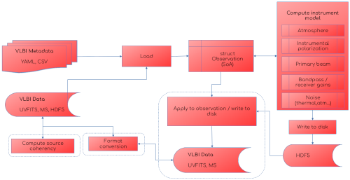

# Summary

`Anime` is an instrument modelling package for radio interferometry, specifically for modelling very-long-baseline-interferometry (VLBI) observations, written in the Julia[^1] programming language [@Bezanson2015]. It aims to model from first principles the effects of Earth's atmosphere and the electronic and mechanical properties of antennas that significantly affect VLBI observations at millimetre (mm) and sub-mm wavelengths, ensuring that the models are statistically consistent with empirical data. It provides realistic instrument models to calibrate, simulate, and produce images of mm-VLBI data sets. It also aims to provide efficient handling of and seamless conversion routines between popular formats used to represent VLBI observations and their metadata.

[^1]: https://julialang.org


# Statement of need

The Event Horizon Telescope (EHT) is a global VLBI network that has produced the first ever high resolution images of supermassive black holes at the centres of galaxies [@M87PaperI; @SgrAPaperI]. The EHT Collaboration has developed new methods to model, calibrate, and analyse data from sparse, heterogeneous VLBI arrays to enable the reconstruction of black hole images at such high resolutions and observing frequencies. The success of these methods relies on accurately modelling the astrophysical source of interest and the propagation path effects that modify the signal on its way to the recorder.

In radio interferometry parlance, calibration is the process of minimizing atmospheric and instrumental effects and imaging is the process of deriving the sky brightness distribution from calibrated data. The boundary between calibration and imaging is variable and one of convenience, since these two tasks can be performed alternately and iteratively, or simultaneously, depending on the scientific problem under investigation and software capability. Within the EHT, the raw data are calibrated using two calibration pipelines, `EHT-HOPS` [@Blackburn2019] and `rPICARD` [@Janssen2019]. The calibrated data are then used by software such as `eht-imaging` [@Chael2018] and `Comrade` [@Tiede2022], which attempt to reconstruct the sky brightness distribution while accounting for residual calibration errors by modelling source and instrumental properties.

Instrument models are also used to generate realistic synthetic data for testing new calibration and imaging methods and to quantify the modelling parameters to be used for real data analysis. `MEQSv2` [@Natarajan2022] is a synthetic data generation software for VLBI that introduces physically motivated signal corruptions to radio observations and is used by the end-to-end simulation and calibration pipeline `SYMBA` [@Roelofs2020]. `ngehtsim` [@Pesceinprep], which is based on `eht-imaging`, models effects such as local weather effects, telescope properties, and emulation of fringe-finding to generate synthetic data for the next-generation EHT (ngEHT). While `MEQSv2` and `SYMBA` have more complex modelling capabilities it is a monolithic piece of software and are considerably slow. `ngehtsim` generates synthetic data faster but does not include some complex effects introduced by `MEQSv2`.

`Anime` aims to provide the speed and flexibility of `ngehtsim` with the complex modelling capabilities of `MEQSv2` by taking advantage of the features offered by the Julia programming language. Julia combines the performance of compiled languages such as C with the ease of development found in languages such as Python. Julia's automatic differentiation support also makes the instrument models provided by `Anime` inherently differentiable and peform parameter space exploration faster. Finally, `Comrade` is written in Julia and can import the instrument models from `Anime` natively.

`Anime` includes models for the troposphere, the lowest layer of Earth's atmosphere, which significantly affects signal propagation at 230 GHz. It models the instrumental contribution to signal polarization to capture the leakage of polarized signals between orthogonal feeds. It also includes models for telescope mispointing, complex-valued (amplitude and phase) bandpass effects that vary over the observing bandwidth, complex-valued time-variable receiver gains, and noise contributions from the atmosphere at the observing frequencies.

Synthetic data generation capabilities are built into `Anime`, with support for popular data storage formats in VLBI. The instrument models are stored in HDF5 format that can be read by any calibration or simulation software with HDF5 support. Metadata are obtained from UVFITS corresponding to real data and  the instrument models are applied to source coherency using the Radio Interferometer Measurement Equation (RIME) [@HBS1996]. The RIME expresses the relationship between true and measured *visibilities*, complex-valued quantities obtained by correlating the voltage patterns observed at two different locations, by casting them into a linear algebraic formalism that describes how the propagation path effects modify the signal. In the 2 x 2 *Jones matrix* formalism [@OMS2011] that `Anime` implements, the generic RIME can be written as

$$
\mathrm{V}\_{pq} = \mathbf{\textit{G}}\_p \left( \sum\_{s} \mathbf{\textit{E}}\_{sp}\\, \mathrm{X}\_{spq}\\, \mathbf{\textit{E}}\_{sq}^H \right) \mathbf{\textit{G}}\_q^H,
$$

where $\mathbf{X}\_{spq}$ is the source coherency that will be observed in the absence of corrupting effects, $E\_{sp}$ and $G\_p$ are complex-valued matrices describing various propagation path effects and $\mathbf{V}\_{pq}$ are the measured visibilities corresponding to the baseline formed by stations $p$ and $q$.

# Code structure
Figure 1 shows the components of `Anime`. VLBI data and metadata are loaded from disk to a Structure of Arrays (SoA) data structure. The instrument modelling functions interface with this structure and output the gain tables in HDF5 format. The functionality within the dashed lines is optional if `Anime` is used only for computing gain tables for calibration.



`Anime` can be run in one of two modes: modular and pipeline. In modular mode, it can be imported like any other Julia package and instrument models are computed by calling the relevant functions. The routines to read/write/convert between storage formats and diagnostic plotting tools can also be called individually. In pipeline mode, little to no user interaction is required to generate a series of instrument models based on observation settings read from existing metadata, create new data sets from scratch and apply the instrument models to data. These data can be stored in both the CASA Measurement Set (MS) format[^2] and the legacy UVFITS format commonly used within the EHT. All observation settings for running `Anime` in this mode can be provided in a `YAML` configuration file. The following example shows how to generate synthetic visibilities (Figure 2) from scratch using a sample `YAML` configuration file included with the source code.
```julia
using YAML
using Anime
# load YAML file with observation parameters 
y = YAML.load_file("config.YAML", dicttype=Dict{String,Any})
h5file = "models.h5"
# Generate MS from existing UVFITS
msfromuvfits(y["uvfits"], y["msname"], y["mode"])
# compute source coherency
run_wsclean(y["msname"], y["skymodel"], y["polarized"], y["channelgroups"], y["osfactor"])
# load data and observation parameters into Observation struct
obs = loadms(y["msname"], y["stations"], Int(y["corruptseed"]), Int(y["troposphere"]["tropseed"]), y["troposphere"]["wetonly"], y["correff"],
y["troposphere"]["attenuate"], y["troposphere"]["skynoise"], y["troposphere"]["meandelays"], y["troposphere"]["turbulence"],
y["instrumentalpolarization"]["visibilityframe"], y["instrumentalpolarization"]["mode"], y["pointing"]["interval"], y["pointing"]["scale"],
y["pointing"]["mode"], y["stationgains"]["mode"], y["bandpass"]["bandpassfile"], delim=",", ignorerepeated=false)
# compute instrument models
troposphere!(obs, h5file)
instrumentalpolarization!(obs, h5file=h5file)
pointing!(obs, h5file=h5file)
stationgains!(obs, h5file=h5file)
bandpass!(obs, h5file=h5file)
thermalnoise!(obs, h5file=h5file)
# write changes to MS and convert to UVFITS
postprocessms(obs, h5file=h5file)
mstouvfits(y["msname"], "test.uvfits", "corrected")
```


[^2]: https://casa.nrao.edu/Memos/229.html

# Similar Packages
- `MEQSv2` [@Natarajan2022]: A synthetic data generation package for VLBI written in Python. It was the first VLBI simulator to include complex mm-wave observation effects used in the EHT and can compute most instrument models found in `Anime`.
- `SYMBA` [@Roelofs2020]: An e-nd-to-end synthetic data generation pipeline that uses `MEQSv2` to generate synthetic data and calibrates them with `rPICARD`, introducing residual calibration effects, that closely match the properties of real EHT data.
- `ngehtsim` [@Pesceinprep]: A fast and flexible (sub)mm VLBI synthetic data generator for the EHT and ngEHT based on `eht-imaging`, adding capabilities such as simulation of local weather effects and fringe-finding residuals.

# Acknowledgements

This work was supported by MSIP2...

# References
