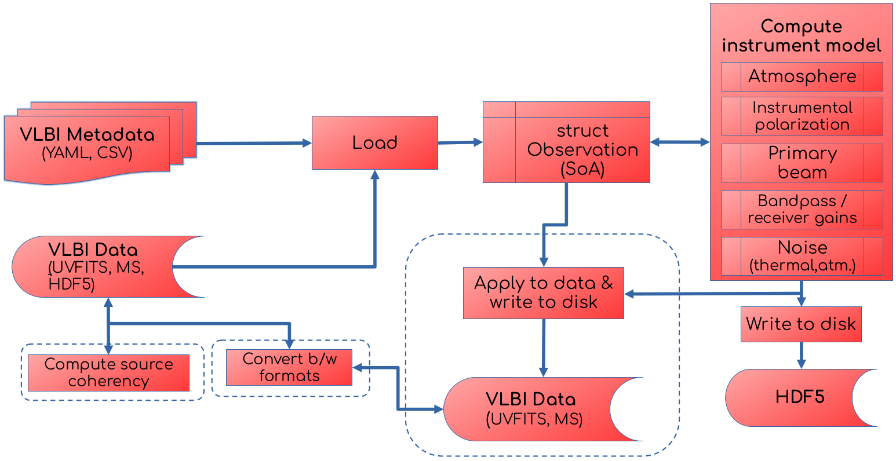
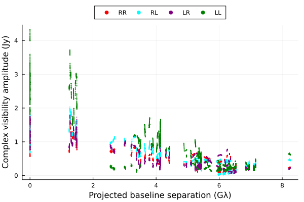

# Summary
`Anime` is an instrument modelling package for modelling the instrument response for very-long-baseline-interferometry (VLBI) arrays, written in the Julia[^1] programming language [@Bezanson2015]. It aims to model from first principles the effects of Earth's atmosphere and the electronic and mechanical properties of antennas that significantly affect VLBI observations at millimetre (mm) and sub-mm wavelengths, ensuring that the models accurately represent the nature and character of variability seen in real VLBI measurements. It provides realistic instrument models to calibrate, simulate, and reconstruct images of astronomical sources from mm-VLBI observations. It also aims to provide efficient handling of and seamless conversion routines between popular formats used to represent VLBI observations and their metadata.

[^1]: https://julialang.org

# Statement of need
The Event Horizon Telescope (EHT) is a global VLBI network that produced the first ever high resolution images of supermassive black holes at the centres of M87 [@M87PaperI] and the Milky Way [@SgrAPaperI]. New telescopes are added to the network regularly, while new locations are being considered for future stations. A physics-based approach to model atmospheric and instrumental characteristics is essential to design new instruments and understand existing ones. Such a "forward modelling" approach also aids in developing and testing new algorithms to model, calibrate, and analyze data from sparse, heterogeneous VLBI arrays such as the EHT and upcoming arrays such as the next-generation EHT (ngEHT).

In radio interferometry parlance, calibration is the process of minimizing atmospheric and instrumental effects and imaging is the process of deriving the sky brightness distribution from calibrated data. The boundary between calibration and imaging is variable and one of convenience, since these two tasks can be performed iteratively or simultaneously, depending on the capabilities of the software. The EHT Collaboration uses two calibration software pipelines, `EHT-HOPS` [@Blackburn2019] and `rPICARD` [@Janssen2019] that build instrument models informed by physics and empirical data and minimizes their effects on the data products sent to downstream analysis methods such as `Comrade` [@Tiede2022] or `eht-imaging` [@Chael2018]. The imaging methods reconstruct the sky brightness distribution based on astrophysical models of the sky while accounting for residual errors in calibration.

Realistic instrument models are also used to generate synthetic data to test new algorithms for data reduction and analysis. `MEQSv2` [@Natarajan2022] is a synthetic data generation software written in Python that introduces physically motivated signal corruptions to radio observations and is used by the end-to-end simulation and calibration pipeline `SYMBA` [@Roelofs2020]. While `MEQSv2` has complex modelling capabilities, it is a monolithic piece of software with inflexible workflow and is considerably slow when simulating hours-long observing sessions. 

`Anime` aims to provide a fast and flexible package to compute complex instrument models by taking advantage of the features offered by the Julia programming language. Julia combines the performance of compiled languages such as C with the ease of development found in languages such as Python. Julia's automatic differentiation support also makes the instrument models provided by `Anime` inherently differentiable and perform fast parameter space exploration. Finally, `Comrade`, the Bayesian modelling framework which is used increasingly within the EHT, is written in Julia, and can potentially import the instrument models from `Anime` natively.

# Software architecture
The software architecture is shown in Figure 1. The data and metadata for generating instrument models are loaded in-memory from various input data formats. The instrument models are stored in HDF5 format on disk. Optional steps (denoted by dashed boxes) involve computing uncorrupted VLBI measurements (or _source coherency_) from a given sky model using external software, applying instrument models to the source coherency to generate synthetic data corrupted by propagation path effects, and converting between VLBI data storage formats.

<div style="display: flex; justify-content: center; align-items: center;">
  <figure>
    
    <figcaption><b>Figure 1:</b> Components and control flow of a typical modelling run.</figcaption>
  </figure>
</div>

### Data structures
The `CjlObservation` composite type, which is predominantly a Structure of arrays (SoA) layout, stores the observation parameters, VLBI data and associated metadata. The generated instrument models are station-based and are represented internally as multidimensional arrays, the ordering and dimensionality of which depend on the specific model being built. A generic model may vary along station, time, frequency and polarization axes.

### Instrument models
`Anime` includes models for the lowest layer of Earth's atmosphere, the troposphere, which significantly affects signal propagation at the observing frequencies relevant to mm-wave VLBI observations (86 GHz and above). It models the leakage of power between polarization measurements made by two feeds nominally measuring orthogonal polarization states. It also includes models for time-variable telescope mispointing, complex-valued (amplitude and phase) bandpass effects that vary over the observing bandwidth, complex-valued time-variable receiver gains, and noise contributions from the atmosphere and receiver electronics. All time-variable aforementioned effects are modelled using Gaussian Processes (GPs) [@GPML2006], with the hyperparameters chosen to statistically match the emipirically measured temporal correlation structure of the quantity being modelled.

### Generating synthetic data
Synthetic data generation capabilities are built into `Anime`, with support for popular VLBI data storage formats such as UVFITS and Measurement Sets (MS)[^2]. Metadata that determine observation parameters are obtained from UVFITS and ASCII files. The computed instrument models are applied to the uncorrupted data using the Radio Interferometer Measurement Equation (RIME) formalism [@HBS1996]. The RIME is a linear algebraic framework that models the relationship between propagation path effects and the astronomical signal measured by the interferometer at two different locations. In the 2 x 2 *Jones matrix* formalism [@OMS2011] that `Anime` implements, the generic RIME can be written as

$$
\mathrm{V}\_{pq} = \mathbf{\textit{G}}\_p \left( \sum\_{s} \mathbf{\textit{E}}\_{sp}\\, \mathrm{X}\_{spq}\\, \mathbf{\textit{E}}\_{sq}^H \right) \mathbf{\textit{G}}\_q^H,
$$

where $\mathbf{X}\_{spq}$ is the source coherency observed in the absence of corrupting effects, $E\_{sp}$ and $G\_p$ are complex-valued matrices describing various propagation path effects and $\mathbf{V}\_{pq}$ are the VLBI measurements (also known as _visibilities_) corresponding to the baseline formed by stations $p$ and $q$.

### Runtime modes
`Anime` can be run in modular or pipeline modes. In modular mode, the user imports `Anime` like any other Julia package and computes the instrument models by calling the relevant functions. The routines to read/write/convert between storage formats and diagnostic plotting tools can also be called independently. In pipeline mode, little to no user interaction is required to generate a series of instrument models based on observation settings read from existing metadata, create new data sets from scratch and apply the instrument models to them. All observation parameters for running `Anime` in pipeline mode can be provided in a YAML configuration file. The following example shows how to generate synthetic visibilities with instrument models applied to a sample ring-like astrophysical black hole model. Figure 2 shows the visibility amplitudes against the projected baseline lengths between pairs of antennas in the EHT array.
```julia
using YAML
using Anime
# load YAML file with observation parameters 
y = YAML.load_file("config.yaml", dicttype=Dict{String,Any})
h5file = "models.h5"
# Generate MS from existing UVFITS
msfromuvfits(y["uvfits"], y["msname"], y["mode"])
# compute source coherency
run_wsclean(y["msname"], y["skymodel"], y["polarized"], y["channelgroups"], y["osfactor"])
# load data and observation parameters into Observation struct
obs = loadms(y["msname"], y["stations"], Int(y["corruptseed"]), Int(y["troposphere"]["tropseed"]), y["troposphere"]["wetonly"], y["correff"],
y["troposphere"]["attenuate"], y["troposphere"]["skynoise"], y["troposphere"]["meandelays"], y["troposphere"]["turbulence"],
y["instrumentalpolarization"]["visibilityframe"], y["instrumentalpolarization"]["mode"], y["pointing"]["interval"], y["pointing"]["scale"],
y["pointing"]["mode"], y["stationgains"]["mode"], y["bandpass"]["bandpassfile"], delim=",", ignorerepeated=false)
# compute instrument models
troposphere!(obs, h5file)
instrumentalpolarization!(obs, h5file=h5file)
pointing!(obs, h5file=h5file)
stationgains!(obs, h5file=h5file)
bandpass!(obs, h5file=h5file)
thermalnoise!(obs, h5file=h5file)
# write changes to MS and convert to UVFITS
postprocessms(obs, h5file=h5file)
mstouvfits(y["msname"], "test.uvfits", "corrected")
```
<div style="display: flex; justify-content: center; align-items: center;">
  <figure>
    
    <figcaption><b>Figure 2:</b> Output of code showing amplitudes of complex-valued visibilities plotted against projected baseline separation.</figcaption>
  </figure>
</div>

[^2]: https://casa.nrao.edu/Memos/229.html

# Similar Packages
- `MEQSv2` [@Natarajan2022]: A synthetic data generation package for VLBI written in Python. It was the first VLBI simulator used in the EHT to include complex mm-wave observing effects and can compute most instrument models found in `Anime`.
- `SYMBA` [@Roelofs2020]: An end-to-end synthetic data generation pipeline that uses `MEQSv2` to generate synthetic data and introduces residual calibration effects that closely match the properties of real EHT data.
- `eht-imaging` [@Chael2018]: A general-purpose python package for imaging EHT data, with simulation modules for generating synthetic data.
- `ngehtsim` [@Pesceinprep]: A fast and flexible (sub)mm VLBI synthetic data generator for the EHT and ngEHT based on `eht-imaging`, adding capabilities such as simulation of local weather effects and fringe-finding residuals.

# Acknowledgements
This work was supported by MSIP2...

# References
